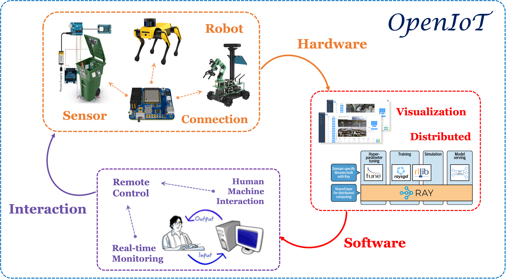

# OpenIoT System

In response to the current issues of inadequate community instrument inspection, difficulty in manual inspection operations, and the lack of effective solutions for high-risk areas, our team proposes a **"Community Safety Inspection System based on the Internet of Things (IoT)".** This system consists of three major components: hardware modules, software services, and an interaction system. It mainly includes five core components: sensor modules, quadruped robots, cloud-based databases, front-end visualization platforms, and back-end support systems. **The goal is to address the industry's demand for efficient and cost-effective community safety inspections.**

**Firstly**, the system collects data indicators such as temperature, humidity, or content levels from the field through sensor modules. This data is then transmitted in JSON format to a cloud database for storage and visualization on a web-based dashboard, allowing personnel to monitor the data. **Secondly**, the system utilizes quadruped robots based on machine vision algorithms to extract instrument readings from video streams and provides feedback for manual online assessment, enabling diagnostics of instrument status. **Ultimately**, this achieves an intelligent community inspection workflow of **"sensor module monitoring - robot pre-inspection - manual online assessment - instrument issue diagnosis".**

 