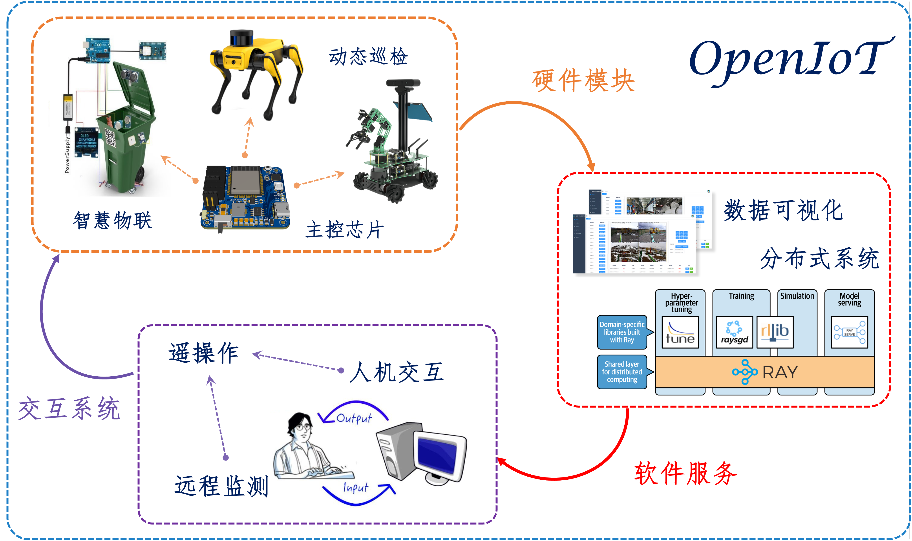

# Welcome to OpenIoT

欢迎来到OpenIoT团队主页!

本团队由福州大学自动化系的3名本科生发起，截止目前拥有18名正式成员。项目立足于福建省工业自动化控制技术与信息处理重点实验室，受到福州大学本科生科研训练计划基金的支持。

我们致力于探索和应用物联网技术，为实现智能化生活和自动化生产做出贡献，充分利用所学知识与技能，为社会带来福祉。我们期待能够与您共同探索物联网技术的无限魅力！

 

## 本站新闻

- **2023年5月09日** 第二届团队即将开启招募，[敬请关注纳新通知](https://fzuiot.site/join/)
- **2023年4月20日** 第一届团队成员招募完毕，[具体团队名单](https://fzuiot.site/about/people/)
- **2023年4月12日** 本站第一轮更新迭代完成
- **2023年3月31日** OpenIoT团队官网正式上线！

 

福州大学OpenIoT团队
