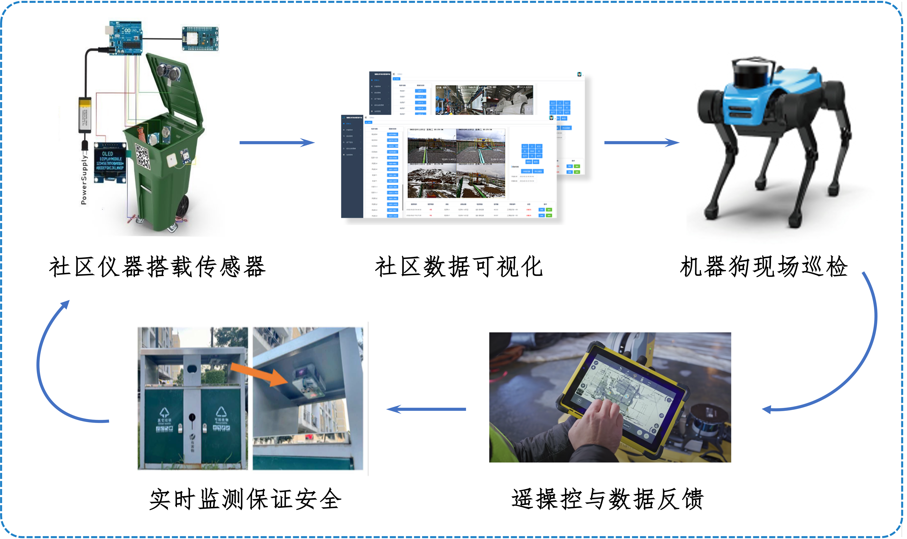
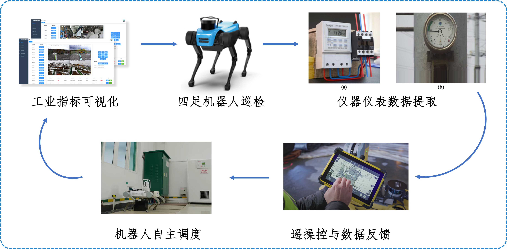
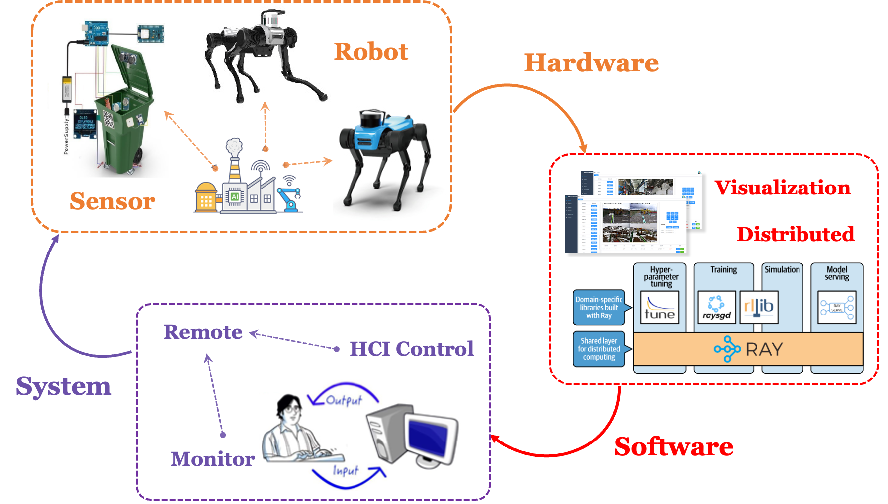

# OpenIoT Document

## 智慧社区方案

针对目前社区仪器仪表巡检不到位、人工巡检操作困难、高危现场缺乏有效方案等现象导致的居民生活安全隐患，本团队提出一套**“基于智慧物联网的社区安全巡检系统”**。该系统由硬件模块、软件服务和交互系统三大部分组成，主要包括：传感器模块、四足机器人、云端数据库、前端可视化平台、后端支持系统等五个核心组件，旨在解决业界对于高效用、低成本的社区安全巡检需求。

首先，该系统通过传感器模块采集现场的温湿度或内容物含量等数据指标，再以JSON形式传递给云数据库存储并可视化到Web端仪表盘，供工作人员监测。其次，该系统基于四足机器人，利用机器视觉算法对视频流中的仪器仪表进行提取，并反馈给人工在线评估，对仪器状态作出诊断。最终实现**“传感模块监测—机器人预巡检—人工在线评估—仪器问题诊断”**的智慧社区巡检工作流。

## 智慧工厂方案

结合智能安全巡检系统，四足机器人能够与多种传感器、相机和通信设备配合使用，实现实时监测、数据采集和远程操作，为工业、社区或仓储等领域的巡检工作提供了更加高效安全的解决方案。这种综合应用有望推动巡检领域的数字化和智能化转型，提升巡检效率，降低人员风险，提高巡检数据的准确性和可靠性，为企业提供更先进的巡检服务，助力业务的持续发展。

 

## OpenIoT System Flowchart 

 
